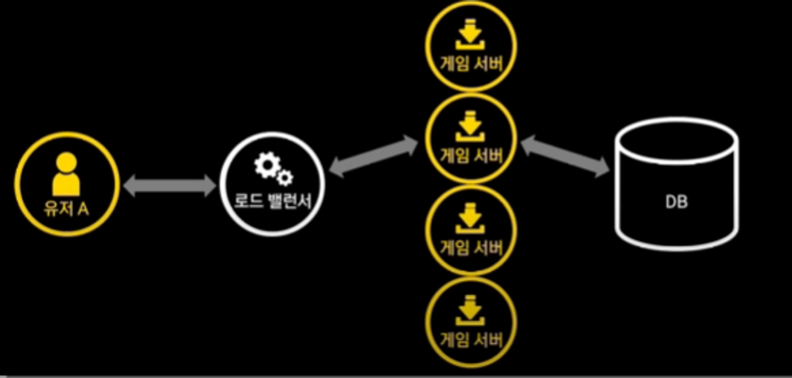
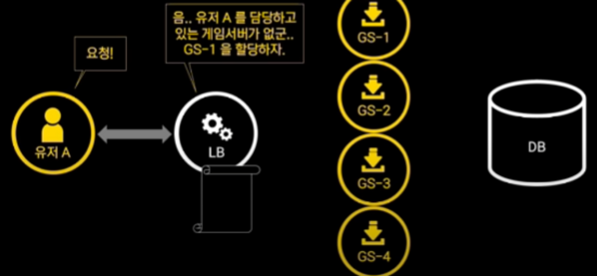
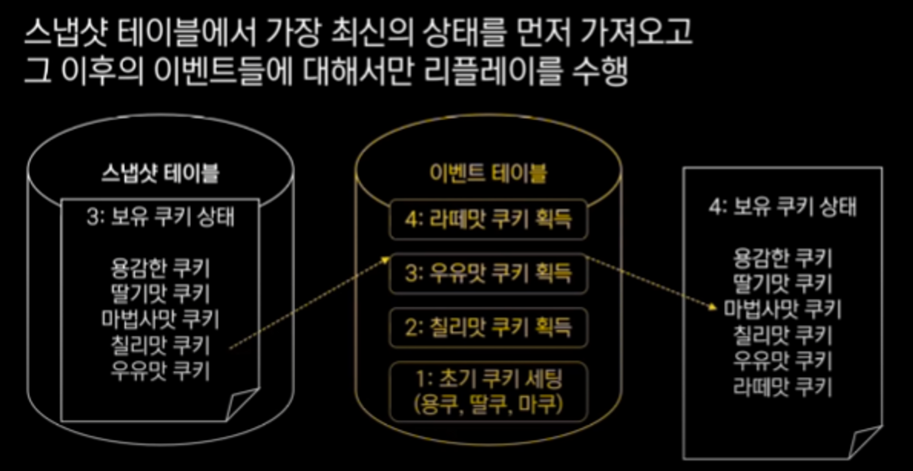
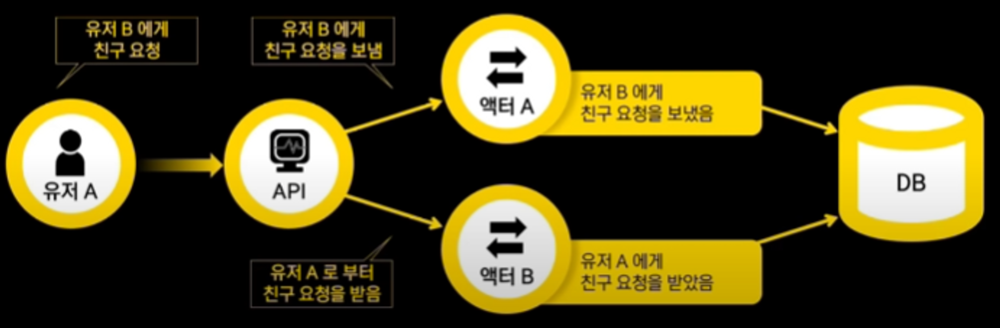
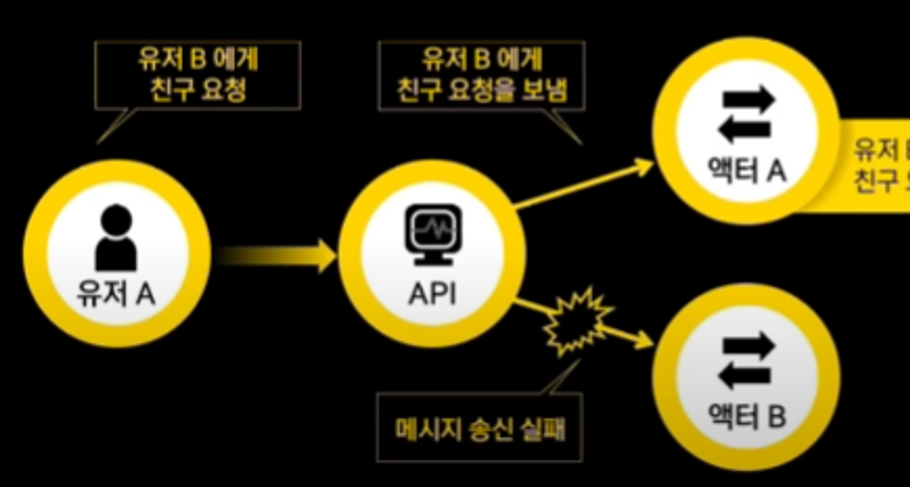
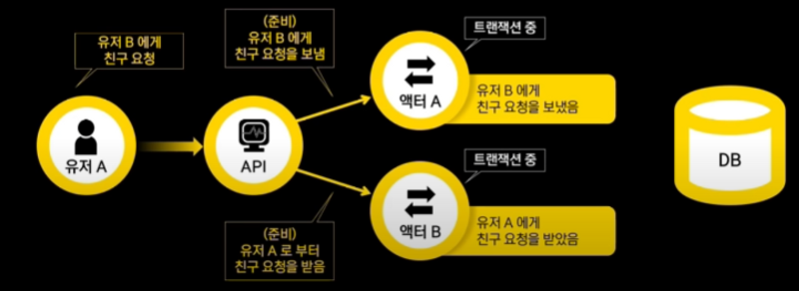

**부하를 처리하기 위해 어떤 기술을 썼을까?**

QPS 초당 쿼리 수 1초 동안 받는 검색 트래픽의 양을 측정한 것

RPS 초당 서버에 전송되는 요청의 수

전체적인 아키텍쳐에 영향을 끼치는 의사결정 Stateless 서버 vs Stateful 서버

**Stateless**

서버가 유저 상태를 저장하고 있지 않아서 필요한 경우 매번 DB나 캐시에서 불러와서 요청을 처리한다

**Stateless 서버구조**

**Stateful**

서버가 메모리상에 유저의 상태를 저장하고 있기 때문에 유저의 요청은 서버에 저장된 상태를 바탕으로 처리한다.

**Stateful 서버구조**

특정 유저의 요청을 처리할 수 있는 게임 서버는 한 개로 특정되기 때문에 로드밸런서가 유저와 게임서버간 매핑을 잘 관리해야된다. 특정 유저가 어떤 게임 서버에도 할당되있지 않다면 특정 서버를 로드밸런서가 할당하게한다.

이후 할당된 서버로만 요청을 받게된다. 여기서 킹덤은 Stateful 구조를 선택하게 되었는데 왜 확장성을 포기하고 세션을 저장하는 방식을 선택했는가?

- 게임 특성상 클라 요청 및 상태 변화가 빈번(Stateless 구조 경우 매번 DB에서 상태를 읽어야 해서 비효율적)
- 게임 특성상 유저 상태가 굉장히 커질 수 있어서 매번 DB에서 가져오기에는 DB 부담이 커질것이라 판단
- 서버 메모리를 쓰는 Stateful 구조가 레이턴시 및 성능에 이점이 많고 이벤트 소싱과도 궁합이 잘맞았음

분산 Stateful 시 고려해야할것들

**Q. 코디네이터 노드가 죽거나 상태가 날라가면?**

1. 코디네이터 상태는 CRDT를 통해 클러스터 전체에 분산 저장된다.
2. 죽은 노드는 클러스터에서 제외하고 다른 노드가 코디네이터가된다.

**Q.특정 노드에 문제가 생겼을 때 이것을 어떻게 알아차리지?**

1. 하트비트를 기반으로 노드에 문제가 생기면 클러스터에서 노드 제거

**아카 클러스터를 써서 장점**

- 안정성 유지보수 알아서 해준다
- PEER TO PEER이라 특정 노드 죽어도 단일 장애 지점이 없다
- 다양한 요구 사항을 확장성있게 구현하고 클러스터내 샤딩 가능
- 노드 수를 늘리는것만으로도 큰 부하를 처리하게됨
- Stateless에 비해 동시성 컨트롤이 명확함 DB Lock 의존하지않기때문

**단점**

- 유저 닉네임 고유성 체크시 천만명 넘는 닉넴을 메모리에 가지고 있어야되서 1초에 수십건 요청을 처리해야된다 이럴떄는 그냥 DB쓴다.
- 운영과 배포가 좀 까다롭다. 인프라 운영, 배포 측면에서는 역시 Stateless가 확실히 유리하더라
- 여러개의 노드가 하나의 클러스터로 묶여 동작해서 각 노드가 독립적인 sateless에 비해 안정성이 덜어지더라
- 분산 트랜잭션이 까다로웠다
- 클러스터 내부 노드 간의 통신에서 메세지 직렬화 역직렬화에 주의해야되는데 롤링 업데이트(무중단 업데이트)시 엑터 메세지 스키마가 변경되면 새로운 노드와 과거 노드간 통신 문제 발생 가능성이 있다.

**데이터 저장 기법**

CRUD : 디비 스케마 설계하고 CRUD 쿼리를 이용해 상태를 저장한다. 이때 DB가 서버 개발의 중심이 되는경우가 많음 서비스가 복잡해질 수록 디비 테이블과 쿼리들이 굉장히 많아지고 조인시 성능 악영향과 인덱스 추가 고려 및 서버 코드내 설계된 도메인 객체들과 DB 스키마가 잘 매핑 되지않는다.

**상태 저장에 대한 새로운 접근 : 이벤트 소싱**

- DB에는 최종 상태가 아닌 발생된 이벤트들을 저장한다.
- 최종 상태는 이벤트들을 리플레이함으로써 얻을 수 있다.

각 이벤트별 숫자를 붙여서 차례대로 리플레이하게된다. 이벤트가 많이 쌓이면 리플레이할 때 시간이 오래걸리게 되는데 따라서 이벤트소싱을 사용할때는 반드시 스냅샷이라는 방법을 같이 사용해야한다.

**이벤트가 많아지면 성능이 오래걸리는거랑 스냅샷은 무슨 차이인가?**

이 방법은 특정 번호의 이벤트까지 리플레이된 상태를 미리 저장해둠으로써 다음부터는 처음부터 리플레이 하지 않도록 하는 최적화 방법이다. 즉, 리플레이시 스냅샷 테이블에서 가장 최신의 상태를 가져오고 그 이후의 이벤트들에 대해서만 리플레이를 수행하게 된다.

스냅샷에서 3번 이벤트를 가져오고 그 이후의 이벤트인 4번 이벤트만 리플레이를 수행하게 된다.

**스냅샷에 대한 고민**

스냅샷을 얼마의 주기로 찍어야할까? 정답은 없다. 로드 테스트를 하거나 실제 운영하면서 조절해야한다. 킹덤에서는 이벤트 300개마다 스냅샷을 찍고있다.

**이벤트와 스냅샷 DB 저장 고민**

목적에 따라 다른데 가시성이 중요하다면 JSON 형태로 도큐먼트DB에 넣거나 킹덤 서버는 저장공간 압축과 명시적인 스키마 관리가 중요해서 프로토버프로 직렬화해서 저장하고 있다.

저장기간도 영구적이면 좋지만 필요없는 옛날 스냅샷 이벤트들은 실시간으로 삭제하고있다.

**이벤트 소싱을 위한 데이터베이스 선정**

- DB 패턴이 매우 단순해서 선택에 제약사항 따로 없음
- 굳이 NOSQL 안써도 RDB도 성능 잘나옴
- 성능, 스케일링, 안정성, 노하우등 다른 요소로 결정하면됨

**이벤트 소싱으로 운영하며 느낀 장점**

- 이벤트 테이블, 스냅샷 테이블 단 두개로 모든걸 할 수 있음
- 디비 스키마가 단순해서 DB관리하는 인프라팀과 협업 쉬움
- 서비스 확장시 DB 스키마 수정안해도되서 편함 로직에 집중
- INSERT, SELECT 두개만 써서 편함 부하 테스트 예측도 쉬움

**이벤트 소싱과 이벤트 기반 아키텍처의 오해**

연관지어 생각하는 경우가 많다 기본적으로 이벤트 소싱은 상태 저장을 위한 기법이라 다른 목적으로 사용하려고 하면 현실적으로 잘 맞지 않는 경우가 많음.

**킹덤의 로직 과정**

1. 발생된 이벤트들 DB저장 (이벤트 소싱)
2. 엑터 상태 변경
3. 클라리언트 결과 변환
4. 변경된 엑터의 상태와 발생한 이벤트를 바탕으로 비동기 작업 수행
    1. 로깅
    2. 랭킹 REDIS 갱신
    3. 카프카 이벤트 발행

친구 요청 기능

여기서 예외 상황

b로 가는 메세지 송신이 실패했을대 a에서만 이벤트 발생하면 일관성이 깨지게되는데 이럼 어쩔거냐?

**계속 재시도 한다**

- 그동안 클라이언트 응답 못받음

**클라에 성공 응답 주고 서버 내부적으로 계속 재시도**

- 영원히 실패한다면?
- 애초에 클라 요청이 올바르지 않았다면 영원히 실패

**A에 반영된 결과를 롤백한다**

- 이 사실을 클라에게 어떻게 다시 알려주지?
- 롤백마저 실패한다면?

정말 머리가 뜨거워진다.

**대표적인 방법으로 SAGA 패턴**

- 방금 예시로 든 해결 방안들과 유사하고
- 한 두번 구현하는 건 괜찮은데 매번 하려니 너무 어렵고 짜증남

**킹덤에서 사가 패턴은 비실용적**

소셜 컨텐츠가 매우 많고 일일이 사가를 구현하는건 비생산, 난이도 증가

**여러 예외 상황 핸들링 없이 그냥 트랜잭션하고싶어서 2PC 사용**

2PC는 크게 두가지 스텝으로 나뉜다. 준비 단계와 커밋 단계이다. 여기서 발생한 이벤트들을 DB에 직접 저장하는 것이 아니라 API에게 반환하게 된다.

API가 A와 B에서 발생한 이벤트들을 모아서 한번에 DB에 저장해주게된다.  한나의 트랜잭션으로 저장하기 때문에 사가 패턴과는 달리 강력한 일관성 보장이 가능해진다.

DB에 이벤트를 저장한 이후에는 A와 B에 커밋 메세지를 받고 트랜잭션 상태에서 빠져나오게된다. 한쪽이 실패하면 타이머가 존재하게 된다 일정시간이후 트랜잭션 종료안되면 타임아웃으로 실패처리한다.

실제로는 부하테스트를 통해 성능과 데드락 문제가 없는지 검토해야한다. 킹덤 서버 경우 문제없이 사용중이다.

분산 트랜잭션 잘 지원되는 DB써야하는데 **샤딩된 RDBMS 쓰면 일반적으로 분산 트랜잭션이 지원되지 않는 경우가 많다.**

**이벤트가 중복처리 될 수 있음에 항상 유의해야한다.**

카프카에서는 exactly once delivery를 기대하는게 어렵다.

이벤트들을 항상 멱등성하게 만들어 중복처리에도 안전 설계가 베스트