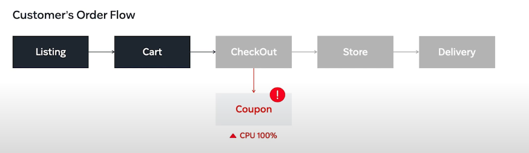
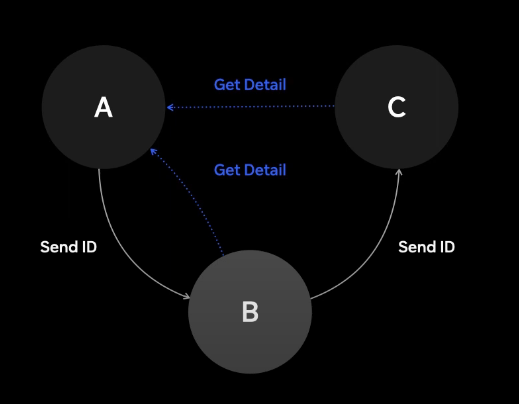
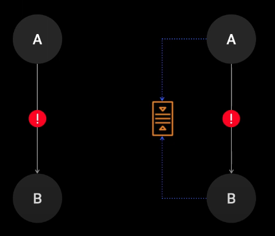
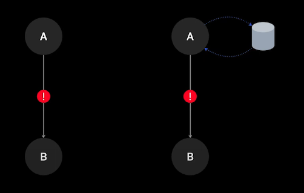

# 쿠팡이 최고의 고객 경험을 위해 장애에 대처하는 방법

마이크로 서비스로 분리 했음에도 불구하고 필요에 따라 각 서비스가 거미줄처럼 연결되면서 단순한 장애가 얘기치 못한 큰 장애로 발전하고 서로 전혀 관계 없을 것 같은 영역이 서로 영향을 받아 장애가 전파되는 일이 지속적으로 발생

**실제 예시**

쿠팡 EATS 서비스에서 쿠폰 서비스에 장애가 전체 구매 플로어를 차단하는 문제가 발생, 쿠폰을 확인할 수 없는 상황이라면 쿠폰을 제외하고 즉 서비스를 다운그레이드 해서라도 주문을 완료 시킬 수 있게 해야 하는데 그렇지 못했습니다.

**그럼 쿠폰을 비동기로 처리하면 되지않나?**

방법이긴 하지만 시스템은 그렇게 동작하지 않았습니다 이는 실제로 고객 경험 에서 뭐가 중요하고 뭐가 중요하지 않은 지를 제대로 판단하지 못하고 서비스를 구성한 것이 주요한 원인이

**장애 리뷰 절차를 수립하고 강화**

서로 남탓하기 보다는 재발 방지에 집중했지만 장애가 줄지않았다. 근본적인 무언가가 부족하다는 것을 인지하게 되었고 우리는 시스템의 구조적인 부분에서 부터 다시 재정이 해야 한다는 생각을 하게됨.

**Critical Serving Path 도입**

고객 관점에서 고객의 주문을 위해서 꼭 필요한 서비스 도메인 을 의미합니다 하지만 좀더 확장해서 본다면 단순히 이러한 서비스 도메인 만을 의미하는 것이 아니라 고객 구매 경험 자체를 의미

중해야 할 부분과 그렇지 않은 영역을 정확하게 나눌 수 있었으며 이를 통해서 시스템을 좀 더 단순한 구조로 바라볼 수 있게 되었습니다

단일 장애 포인트를 제거하라

A - B - C 각 필요한 ID만 가지다 디테일한 정보는 A에게 조회를 요청한다고치면 A가 다운되면 B와 C도 그대로 멈추게된다.

**비동기 큐 사용**

만약 데이터 일관성이 민감한 로직이 아닌경우 장애가 발생해도 비동기로 큐에 담게된다. 주문처리 과정에서는 이런 방식을 채택했다.

Fallback Cache

장애 상황에서만 참고하는 캐시를 둬서 서비스 장애가 놔도 캐시 데이터를 사용해서 서비스를 이어간다. 100퍼센트 완벽한 방법은 아니다.

**서비스 강한 결합의 위험**

서비스를 강하게 결합시키는 것은 구현하기 쉬운 방법이지만, 이로 인해 서로의 영향을 미치며 서비스가 장애를 유발할 수 있습니다.

**적절한 전략의 중요성**

적절한 전략을 통해 서비스 강한 결합을 최대한 피해야 합니다. 이를 위해 가장 쉽게 적용할 수 있는 방법 중 하나는 서킷 브레이커, 벌크헤드, 타임아웃을 적용하는 것입니다.

**디펜더 씨와 SPF의 역할**

디펜더 씨가 SPF가 아니거나 무시할 수 있는 값이라면, 서킷 브레이커, 벌크헤드, 타임아웃 전략 등을 통해 빠른 실패와 적절한 폴 100 전략으로 서비스를 다운그레이드된 상태로 지속적으로 제공할 수 있도록 해야 합니다.

**디폴트 값의 한계 극복**

단순한 디폴트 값으로 서비스를 제공하는 것이 아니라, 값이 없는 상태에서도 간단한 계산 등을 통해 서비스를 제공하여 고객의 영향을 최소화할 수 있습니다.

**스텝 업과 레질리언스를 위한 로드 섀딩**

서킷 브레이크와 함께 시스템의 스텝 업과 레질리언스를 위해 로드 섀딩 기능을 적용하고 있습니다. 이를 통해 CSP에서 처리하기 어려운 트래픽이 일시적으로 유입되어 시스템의 상태를 안정적으로 유지할 수 있게 됩니다.

**A 지도 환경으로의 전환**

2G 환경에서 A 지도로 확장하면서, 특정 업무에 장애 시에도 정상적인 서비스를 제공하거나 장애 영향을 최소화할 수 있는 구조로 변화되었습니다.

**스테이트 엘리스 웹 어플리케이션 배포 개선**

스테이트 엘리스 웹 어플리케이션 배포를 위한 환경을 개선하여 다양한 조건을 자유롭게 설정할 수 있는 환경을 구축했습니다.

**클라우드 환경에서의 영향 개선**

클라우드 환경으로 인한 CSP 장애에 대한 영향도를 개선할 수 있게 되었습니다.

**장애 시 빠른 대응 필요**

서비스를 지속적으로 발전시키며 개발하는 환경에서는 장애가 발생할 수밖에 없습니다. 이럴 때 원인을 빠르게 찾아 제거하는 것이 매우 중요한 포인트가 됩니다.