# 휴식 시간을 지켜줄 안정적인 백엔드 운영과 개발 기법

**두레이는 개발 담당자가 운영**

NHN두레이에서는 자기가 개발한거는 담당자가 서비스를 운영한다. 에러가 나면 예외 로그가 주르륵 나온다. 빠른 장애 대응이 가능하고 본인이 개발해서 클러스터링 구성, 메모리 사이즈, 최적의 서버 구성이 가능하고 운영에 대한 기술조차도 미리미리 준비가 가능하다.

**단점**

개발도하고 운영도해서 언제 장애날지 몰라서 불안하고 피로감이.. 운영은 운영 전문가들이 잘하는데 어플리케이션 개발자가 같이하면 두 분야에 대한 전문성이 필요한데 좀..

### **자동 재시작(Self-Healing)**

재시작을 할 수 밖에없는..

**스레드 차단이 필요한 경우**

**서버에서 데드락이 필요한 경우**

**GC 문제(Death Sprial)**

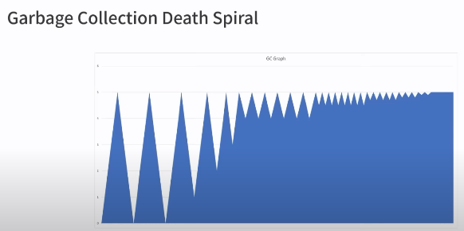

GC진행하면서 3번째부터 점점 컬렉팅되는 양이 줄어들고 GC만 계속 일어나고 메모리 확보에 불가능해짐. 메모리보다 CPU 사용률이 막 올라간다.

JVM을 모른다면 CPU 늘려야된다고 생각할수도있는데 이럴때는 힙과 관련된 이슈라고 판단해야한다.

- 발생 원인
1. REST API에서 정말 많은 데이터를 응답하도록 하거나
2. 스태틱이나 싱글톤 패턴 변수에 과도한 데이터를 적재

- 장애 작업 해결의 무한루프
1. 장애 발생 → 담장자에게 장애 전파
2. 모니터링 툴 확인(CPU, 메모리, 디스크, 네트워크)
3. 로그 확인 → OOM 체크 및 예외 확인
4. 힙덤프, 스레드 덤프 남기기(이것도 시간없어서 KILL -9 ㅋㅋ)
5. 일단 서버 재시작

**분당 Health Check**
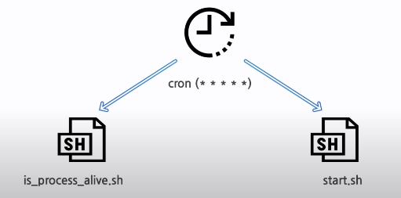

요런 느낌으로 재시작 스크립트 작성, 하지만 **JVM은 OOM에도 죽지않음**저 스크립트는 한번도 제대로 돌지 않게됬다..

**JVM 옵션 추가**

JVM 실행 옵션에서 ExitOnOutOfMemoryError 옵션이 있어서 추가하면 바로 프로세스 kill 해버린다. + 장애 체크를 위해 힙덤프를 남기는 옵션도 추가

첫번째 OOM이 나면 프로세스가 픽 죽는데 어떤 요청을 처리하다 죽었는지에 대한 로그가 남지가 않아서 원인 분석이 너무 어렵다. 옛날 옵션을 찾아봤는데 OnOutOfMemoryError를 사용해서

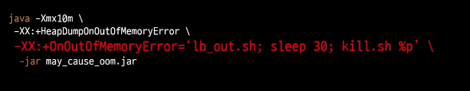
OOM 발생시 로드밸런서에서 아웃시키고 충분히 로그가 남도록 30초 정도 기다리고 서버 다운을 시키고 크론탭에 의해서 재시작되는 좋은 느낌으로 해결

**근데 OOM만 다루는걸로 충분한가?**
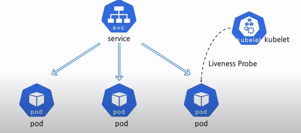

주요 커넥션풀들 처리안되면 서버가 동작하지않는 이슈가 있어서 실용적으로 쿠버네티스의 라이브니스 프로브 기능을 참조하게됬다. 큐블렛이 상태를 지속적으로 체크하면서 문제 생기면 포드 삭제해버리고 레플리카 개수 유지하기위해 새로 등록해버리는데 이런 모습과 같다.

**Actuator HealthCheck Endpoint**

최종적인 모습을 위해 스프링 Actuator HealthCheck Endpoint를 사용했는데 주요 점검 기능은 Disk, DataSource, RabbitMQ, Redis등을 다 스프링에서 지원해준다.
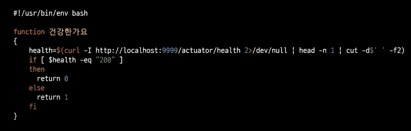

이거시 최종 배시의 모습. OOM을 보는게 아니라 actuator를 호출해서 200인지만 체크하고 아닐때 대응로직! 일시적인 장애는 익일 확인 후 대응가능하게 되었고 무중단 서비스 유지가 된다.

### **과부하를 처리하는 방법**

**cascading failures**

소수 서버의 문제가 다른 서버의 문제로 이어지며 이슈가 점진적 여파

- 원인
1. 일부 서버 과부하
2. 자원의 부족
3. 서버 크래쉬

**시나리오**

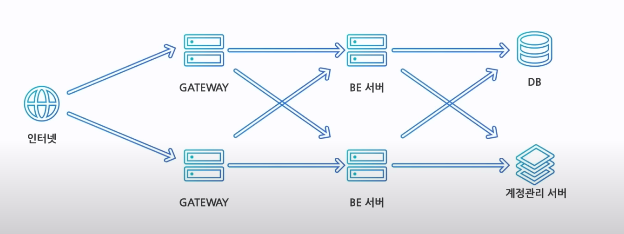
계정관리 서버가 터지면 BE가 터진다. 두번째 백엔드 서버도 터지고 게이트웨이도 터진다..

**지표의 측정(가시화)**

뭐가 문제인지 찾아봐야된다.

Spring Boot의 Actuator를 활용

- Metric과 프로메테우스 Endpoint 활성화

그라파나 연동

측정 항목

- CPU 사용률
- Active 스레드
- 분당 Request 수

그중에서 Active 스레드수에서

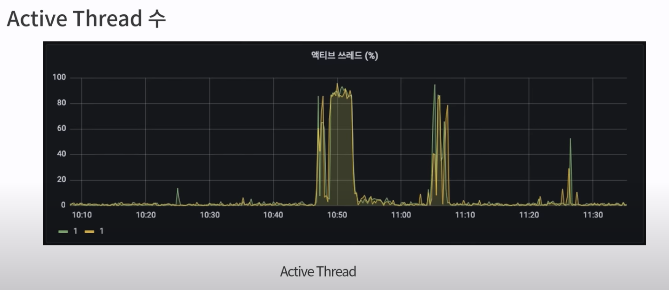
장애 시 톰캣의 스레드풀이 모두 소진되버렸다..

**대응 방안**

1. 스케일 업/아웃
2. 메세지 브로커 지연 처리
3. K8s 오토 스케일 사용
4. 서킷 브레이커 패턴
5. BackPressure 고려해서 수신거부해보자

**스케일업/아웃**

평상시 CPU 사용률은 10%도 안되는데 특정 시점만 90%.. 이런 식이면 훨씬 더 많은 CPU를 사용해야되는데 이러기엔 비용 이슈가 발생

**메세지브로커**

**오토스케일**

이런 단기간 트래픽 스파이크 경우는 오토스케일이 서비스가 기동되는 시간까지 커버가 되지않는다. 사용자들은 이미 불편을 겪는 상황이고 스케일 아웃과 다를바없는 비용 이슈..

**서킷브레이크**

이미 서버에 부하가 발생한 후에 동작해서 장애가 일시적으로 사용자에게 노출되고 간혈적인 오류가 지속 노출된다..

**BackPressure 고려해서 수신거부해보자**

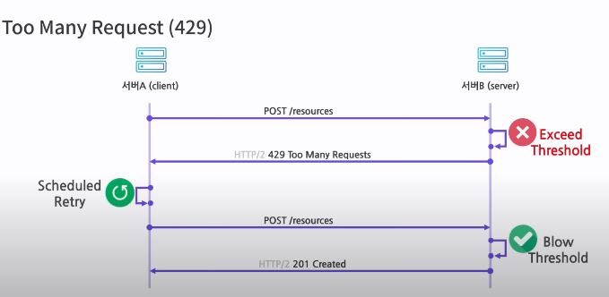
Too Many Request 429 HTTP 상태코드를 이용해보자!

구현은 쉬우나 서버의 처리량 TPS를 일정하게 제한되게 된다.

**Active 스레드 비율**

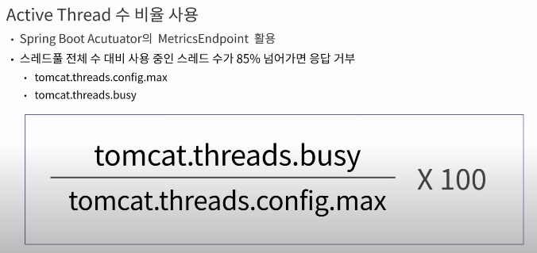
**스로틀링 클래스 예시**

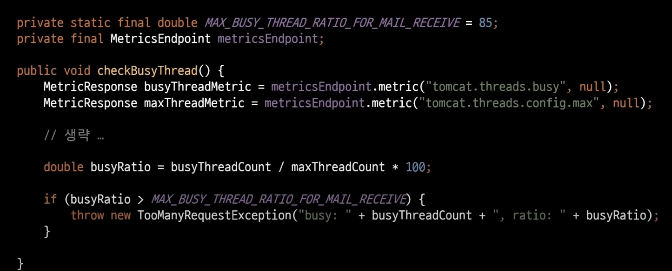
비율 85% 넘어가면 Too Busy 던지도록 할 수 있음

**백엔드에서 HTTP Cache 활용**
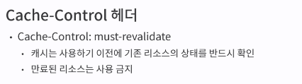

Back to Back시 must revailidate 설정해야한다.

Etag 헤더

- 응답하는 리소스의 버전 제공, 보통 서버 컨텐츠 정보를 대표하는 값이라 유니크한 값을 써야하고 HTTP 특성상 제약이 없어서 해쉬나 최종 수정일을 이용하기도함

If None Match

- 헤더의 값에 Etag를 넣어서 클라이언트가 서버 요청할때 같이 넣어주면 처리하는데 Etag 값만 변경된지 서버가 가진것과 다른지 체크한다.

**시나리오**

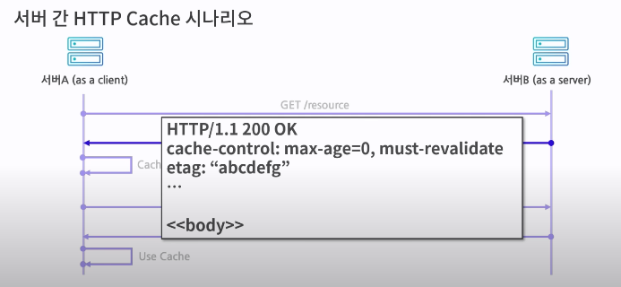
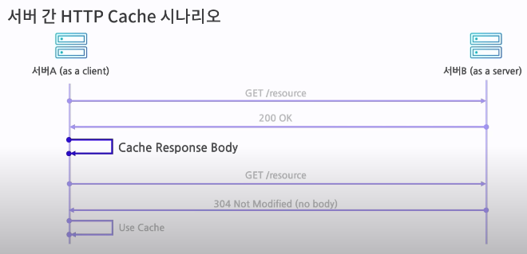
Etag보고 Response Body를 캐시해야겠구나
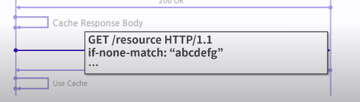

다시 요청할때 If none Math, Etag가 변경사항이 있으면 주세요. 만약 변경사항 없다면 304 body 없음으로 그냥 바로 리턴해준다.

**스프링에서는 WebRequest**

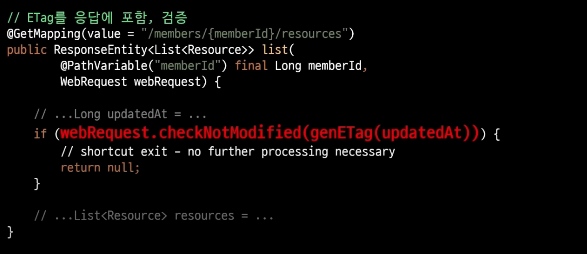
만약 변경사항 없으면 나머지 비지니스로직 처리안하고 return null;

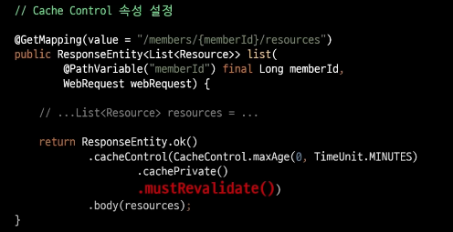
서버 메모리도 부족해서 인메모리는 못쓰고 EhCache라는거 썼음

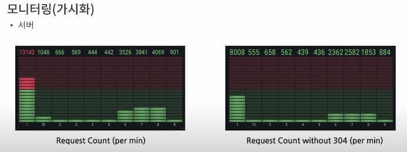
확실히 13000개중 5000개는 캐시가 처리해서 서버 자원을 효율적 사용

**주의**

API URL 외 인증 및 다른 정보로 데이터가 변경되는 경우 사용하면 큰일남 캐시로 다른 사람 정보가 응답될수도있고 HTTP 캐시는 GET에만 적용된다.

서버가 그 자체로 중간 캐시인 Shared Cache로 역할한다. 데이터를 많이 보유 할 수록 Hit 확률이 높아진다.

**네티의 Writing Backpressure 구현**

TCP 소켓 서버를 쓰다가 OOM 발생하거나 성능이 느려진다.

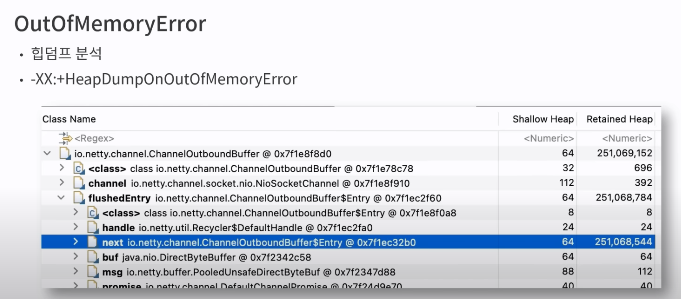
네티 동작상 네트워크 문제가 생기면 카프카의 데드레터큐 쌓듯이 채널아웃바운드버퍼에 채널을 넣어버리는게 이게 가득 차버리면 OOM이 발생한다.

스레드 슬립 10초를 주니 OOM없이 잘 진행됬는데 문제는 응답이 10초가 고정이 된다는것이다. 찾아보니 Channel.isWriteable()이 있는데 버퍼를 수영장으로 치면 물이 오버하면 잠궈버리고 물이 내려가면 벨브를 열어주는 기능을 제공한다.

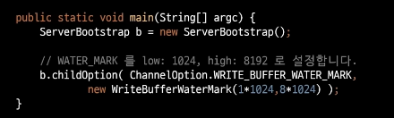
성능 문제면 스레드 슬립을 쓰지않고 수영장 높낮이 설정이 가능함.