MSA는 서비스들이 **느슨하게 결합**된 모임이다. 각 시스템에 집중함으로써 강한 응집을 갖게 된다. 그리고 이벤트 기반 아키텍처가 이를 돕게된다.

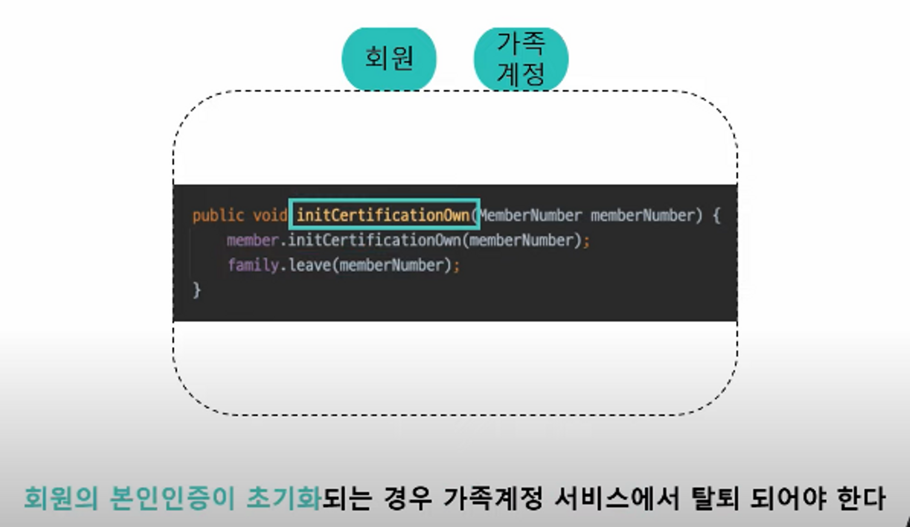
회원과 가족계정 서비스는 한 어플리케이션에 존재한다. 회원의 본인인증이 초기화 되는 경우는 가족계정 서비스에서 탈퇴되는 로직이 위 코드에 작성되어있다.

즉 초기화 로직에 가족 탈퇴 로직이 깊게 관여되는 강한 결합을 가지고 있다. 트래픽이 높아지며 가족계정과 회원이 마이크로서비스로 분리되어야하는 경우가 생겼다.

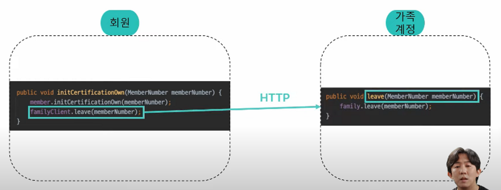
HTTP 요청으로 동기적인 요청을 하게된다. 그래도 강한 결합을 가지고있다. 물리적인 시스템 분리는 느슨한 결합과는 관계가 없다. @Async로 leave를 호출하게 되는 경우를 생각했다.

그러나 비동기로 처리된 http 요청은 스레드 레벨의 의존성을 제거할뿐 회원의 초기화에 가족 계정 탈퇴라는 후속행위가 필요하다는 의도는 그대로 존재하게된다.

**메세징시스템만 쓰면 해결될까?**

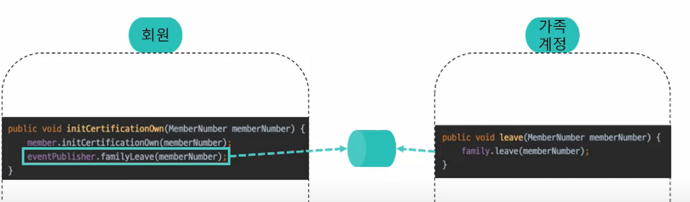
회원 시스템은 가족계정 탈퇴 메세지를 큐로 전송하고 가족계정 시스템은 메세지를 구독하여 탈퇴를 처리한다. 물리적으로 분리 + 메세지 시스템까지 분리한다고 느슨한 결합을 보장하지는 않는다.

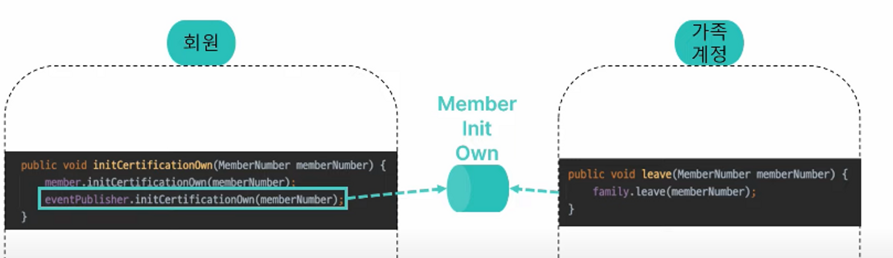
가족 계정 비지니스에 관여하지않아야한다. 회원은 초기화하고 회원 초기화 메세지를 발행할뿐 뒤에 무슨 일이 일어나는지 이제 모른다. 즉 메세지가 담는 결과에 따라 다른 의미를 지니게 되는것이다.

배달의민족 메이라는 캐릭터가 밥을 먹었다. 이때 밥을 먹었으니 씻어라, 설거지를 해라 라는 메세지를 발행하는것이 아니라 밥을 먹었다는 메세지를 발행한다.

**이벤트로 인해 달성하려는 목적이 아닌 도메인 이벤트 그 자체를 발행**

**이벤트 발행과 구독**

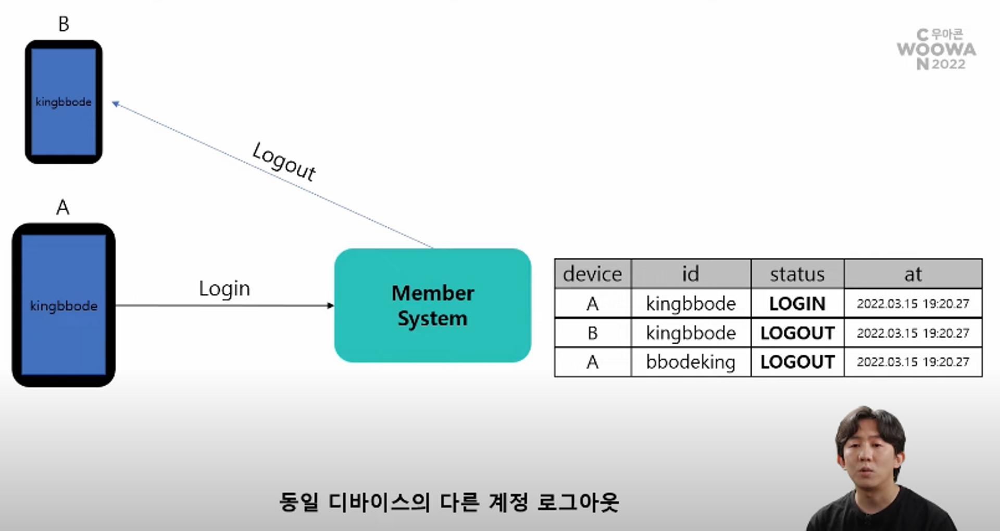
동일 디바이스의 다른 계정을 로그아웃 시켜야한다.

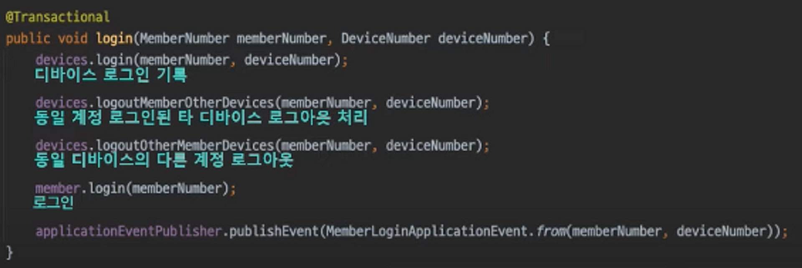
도메인의 주요 행위가 뭔지 파악하기 힘들다.

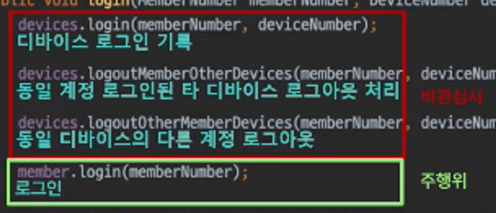
애들은 비관심사고 진짜 주행위는 로그인이다.

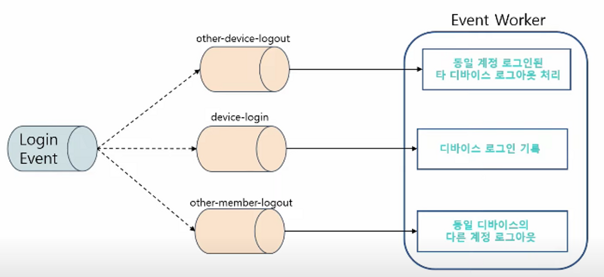
하나의 이벤트를 여러 구독으로 처리할 수 있다.

분리 후 코드

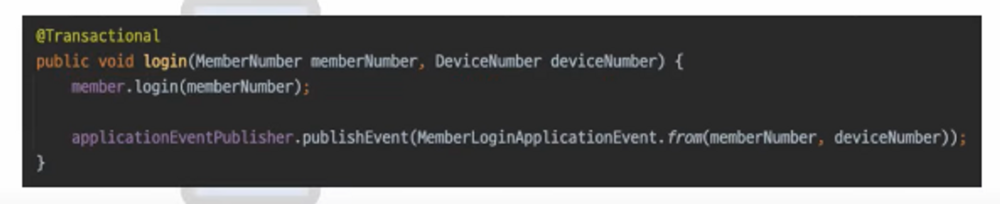
**이벤트 저장소** 왜 필요 했을까?

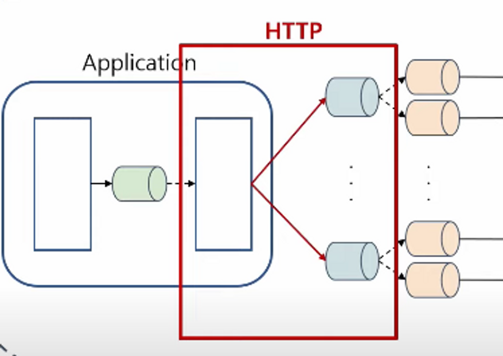
내부 이벤트를 발행하는 과정은 http 통신이라 그 과정에서 얼마든지 문제가 생길 수 있음 따라서 메세징시스템의 장애가 시스템 전체의 장애로 번질 수 있음

도메인 로직은 실행되었는데 장애가나서 이벤트는 발행되지않는 이상한 현상이 생길 수 있음(브릿지 상태)

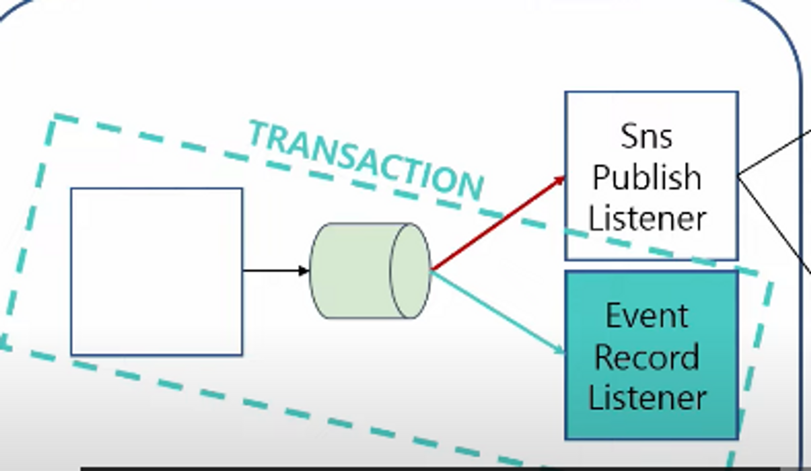
SNS 이벤트 발행에 실패하여도 어떻게든 간에 이벤트 저장소에는 메세지가 저장될것이다. 후에 재발행이 가능하다 이벤트를 안전하게 관리할려면 어떤 저장소를 골라야할까?

조회 및 쓰기 특성에 알맞은 저장소를 쓸려면 작은 단위로 저장이 되고 고속처리가 되어야하기때문에 RDBMS는 좋은 선택지가 아니였다. 일단 이 특성을 생각하기전에 필수적으로 고민할게있다.

도메인 행위와 이벤트간 신뢰성 확보를 위해서는 필수적으로 트랜잭션이 필요하다. 현재 사용하고있는 도메인 저장소와 트랜잭션을 묶을 수 있는 저장소인지 확인해야한다.

다중 데이터베이스에서 분산 트랜잭션을 구현한은일은 굉장히 어려움

1. 낮은 확률로 발생가능한 데이터 유실을 안고 다중 DB 사용하느냐
2. 유실은 안된다 DB를 하나로 공유하자

신뢰성이 꽤 중요한 시스템이기때문에 배달의 민족은 2번을 선택함

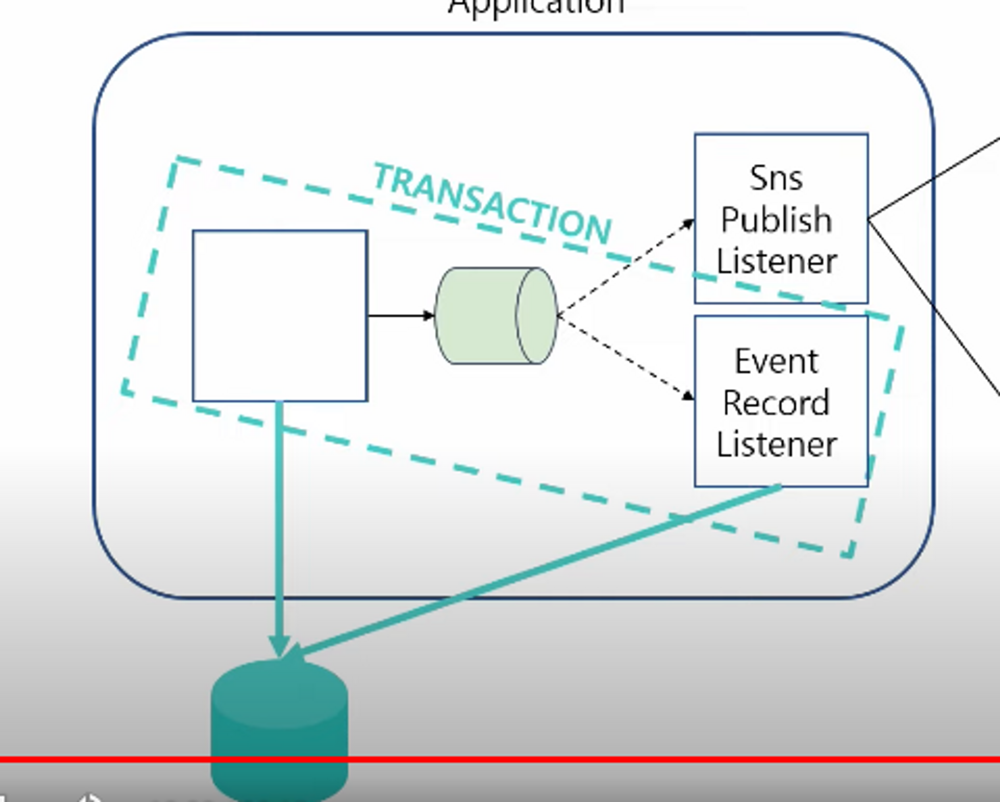
동일 저장소를 통해 데이터베이스를 저장하고 이벤트를 발행함에 안정적인 정확성을 보장하는 방식을 트랜잭션 아웃박스 패턴이라고도 한다. 로컬 트랜잭션을 사용하여 DB에 저장하고 이벤트를 발행하며 정합성을 보장한다.

**이벤트 유실 문제 해결**

이벤트 저장소를 통해 발행 여부 데이터를 정의하여 문제를 해결

처음 이벤트 발행 여부는 published false로 저장하고 발행일 추가한다.

이벤트 발행 여부를 수신받으면 published를 true, 발행일 변경한다.

**만약 첫번째 구독자 계층에서 메세지 발행이 실패한다면?**

미발행된 메세지는 별도 배치를 돌려서 처리