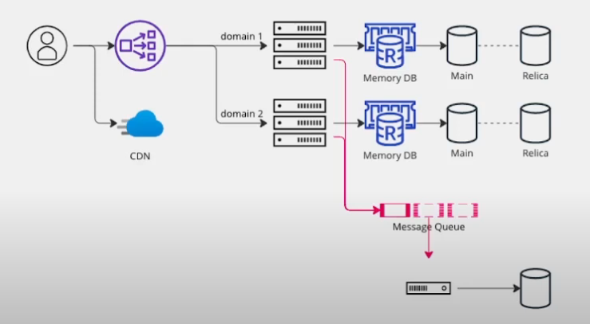

# 대규모 트래픽 서비스 개발 어떻게 설계 할까? 시리즈

**일반적인 초기 서비스 형태**

서비스 내부에서 기능을 분리하면 각각의 서버군이 형성될 수 있습니다. 이렇게 서버군을 구성함으로써 각 기능에 최적화된 자원 할당과 메모리 사용 형태를 선택할 수 있습니다. 또한 리플리카를 통해 시스템의 안정성을 확보합니다. 필요한 컴퓨팅 처리가 발생하면 해당 요청을 메시지 큐에 담아 특정 처리 서버에서 처리하고, 이후 데이터를 스토리지에 저장하거나 추가적인 은행 기능을 구현할 수 있습니다.

초기 서비스 설계 시 AWS에서 지원하는 다양한 서비스를 고려해야 합니다. CDN, 로드밸런싱, EC2, RDB, S3, 서버리스(AWS Lambda) 등 다양한 컴포넌트를 활용하여 시스템을 구축할 수 있습니다. 또한 외부 솔루션을 통해 필요한 기능을 보완할 수도 있습니다. 그러나 **초기 서비스 구성 시 과도한 대규모 트래픽에 대한 고민은 오버엔지니어링의 가능성**을 내포하므로 주의가 필요합니다.

이렇게 서비스를 구성함으로써 초기부터 확장성과 유연성을 고려하면서 중요한 요소들을 잘 조합하고 관리하는 것이 핵심입니다. 위 내용을 좀 더 자세하게 설명하였습니다.

**캐시가 중요**

서비스에서 대규모 트래픽을 처리할 때 캐시의 역할은 매우 중요합니다. 초기 서비스에서는 캐시의 확장성을 놓치기 쉬운데, 이로 인해 사용자 데이터가 빠르게 늘어나는 상황에서 캐시 관련 문제가 발생할 수 있습니다. 확장성 부재로 인해 캐시의 카파시티를 늘리거나 데이터 센터를 이동해야 할 수도 있습니다. 이런 상황에서 제대로 된 설계가 이루어지지 않으면 서비스에 큰 장애로 이어질 수 있습니다. 사용자 경험도 저하되며 장애까지 발생할 수 있는 상황입니다.

저는 글로벌 메신저 회사에서 6년 동안 코어 팀에서 근무하면서 이러한 확장성에 대한 고민을 많이 해왔고 실제 문제점도 많이 겪어봤습니다. 이런 유사한 상황에서 캐시의 물리적인 이동과 카파시티를 늘려야 하는 상황에서도 서비스의 영향 없이 안정적으로 캐시 마이그레이션을 어떻게 처리했는지 소개하겠습니다.

로드 밸런서를 통해 들어온 요청은 대부분 캐시 노드 하나의 처리를 하게 됩니다. 중간에는 리플리케이션을 하긴 하지만, 제대로 된 설계가 이루어지지 않았다면 캐시가 무너지면 결국 사용자 요청의 처리가 제대로 이루어지지 않아 과부하로 인해 서버가 다운되거나 행아웃 상황이 발생할 수 있습니다. 이런 문제를 해결하기 위해서는 캐시의 중요성을 인지하고 확장성 있는 설계를 해야 합니다.

매 시즌 서비스에서는 캐시가 어떻게 작용하는지를 파악해야 합니다. 사용자 데이터가 어떤 형태로 전달되고 다운로드되어 유저에게 딜리버리되는지를 분석해야 합니다. 위와 같은 상황을 고려하여 대규모 트래픽에서 캐시가 어떻게 작동하는지 설명하고 있습니다.

**확장하기 힘든 구조의 해싱 알고리즘**

**대규모 트래픽 서비스에서 캐시마이그레이션**

대규모 트래픽이 실시간으로 발생이 되는 이런 메시지 서비스에서는 캐시는 상당히 중요한 역할을 하게 됩니다 이럴때 캐시 서버의 노후와, 캐파시티를 늘려야할때 문제가 생김

**기존 설계의 문제점이 존재**

- 캐시서버 해싱 알고리즘

첫 번째 같은 경우는 이제 기존 해시 서버에 해싱 알고리즘이이 서버대수가 모수가 돼서 이 모수가 돼서 특정 식별자 그리고 키값이 될 수도 있고요이 키를 나눠서 캐시에 저장될 키를 만들어 내게 되는데이 문제가 뭐였냐면 이제 분모를 서버 대스로 했었다는 것입니다 만약 해시 서버의 대수가 변경이 된다면 이 부분이 병변이 이루어진다면 기존에 접근했었던 이런 맵핑 됐었던 키값들이 탑들이 모두 틀어지게 되는 것

- 실시간 서비스 도중 장애 발생시

캐시 서버를 빼내거나 넣지 못한다는 자유롭게 리얼타임으로 넣지 못한다는 상황이 오게 됐다는 것 이 말은 무엇이냐면 이제 별도의 어떤 설정을 두어서 PC 서버리스를 관리한다거나 아니면 어떤 핫 리로드 기능을 넣어서 즉각적으로 백엔드 설정을 가지고 페이스서버를 추가할 수 있게끔 제가 한다거나 이러한 것들이 설계가 전혀 이루어지지 않았음

**두가지 모두 공통적인 원인은 확장성의 부재**

1. 노드를 추가하거나 제거하기 어려운 데이터 구조
    1. 해싱 알고리즘 n으로 단순히 나눈 키값으로 구조를 이루고 있어서 추가 삭제시 완전히 마이그레이션 해야하는 문제
2. 노드를 컨트롤 할 수 없는 시스템 설계
    1. 하나의 서버가 가지고있는 설정을 가지고 필요한 경우 서버와 통신을 해서 핫로드를 추가해야할때 실시간으로 적용이 가능한가

**해결 방법**

**Consistent 해싱**

유저의 요청을 고르게 분산할 수 있다. 스케일링이 되더라도 요청을 동일한 노드로 접근할 수 있게 보장해준다. 내부적으로 몇가지 장치로 분산하겠지만 요약하자면 위와 같다.

컨시스턴시 해싱은 대규모 시스템에서 요청이나 데이터를 균등하게 분배하기 위해 사용되는 기술입니다. 이는 주로 로드 밸런싱을 필요로 하는 시스템에서 많이 사용되는 방식입니다.

**균일하게 분포 안되면?**

가상의 노드 작업(VNODE)이 들어감

기존 사이사이 죽었던 노드들이 있다면 살아있던 노드(머신0, 머신1)을 해시로 나눠 노드 복제해서 한곳으로 쏠리지않고 인접한 노드에 들어오게 맞춰준다.

실제로 카산드라에서도 일관된 캐싱을 사용하여 개발되었음, 사용자 접근시 높은 캐시 히트율 보장하고 노드 추가 삭제에 자유롭게 되어있음.

1. 캐시 서버 클러스터가 탄력적 확장/축소 해야 한다
    1. 크리스마스 경우 더 버스트한 요청이 들어올것. 많은 서버를 수평 확장하는 경우가 생김
2. 서버 클러스터의 엘라스틱한 스케일링이 가능함
3. 파티셔닝 하기가 수월하다
4. 데이터가 분할하더라도 균일한 배포가 가능함
5. 고가용성을 가능케해서 안정적 서비스 가능

**어떻게 업데이트하고 배포할까?**

기존에 클래스를 변경하기 위해서 백엔드 어플리케이션에서 이제 서비스 재시작 없이 설정을 읽어서 반영을 해야 되는 기능이 필요하게 되는데요 이거를 이제 리로드라고 명칭을 정해 보도록 하겠습니다.

핫**리로드**

핫리로딩을 통해 실시간 서비스에 서버를 추가하거나 제거할 수 있는 구성을 설계하려면 명세서를 설정으로 분리하는 것이 중요합니다. 예를 들어, 캐시 노드들을 관리하기 위해 프라이머리 캐시 클러스터와 스탠바이 캐시 클러스터를 준비합니다. 이때 각 캐시 노드에 대한 식별자(IP 또는 호스트 이름 등)를 명세서에 정의하고, 이 명세서를 추가되는 서버 또는 변경사항을 반영할 준비를 합니다.

리얼타임 서비스에 영향을 주지 않으면서 핫리로딩을 가능하게 하기 위해 다음 단계를 고려해야 합니다.

1. **설정 분리**: 서버와 설정을 분리합니다. 설정은 별도의 파일로 관리하고, 변경될 때마다 서버 재시작 없이 적용할 수 있도록 합니다.
2. **서버 리스트 관리**: 캐시 클러스터의 서버 리스트를 유연하게 관리합니다. 추가되는 서버의 식별자(IP 등)를 명세서에 정의하고 업데이트합니다.
3. **핫리로딩 전략**: 배포 전에 리로드 시나리오를 준비해야 합니다. 변경 사항이 배포되기 전에 실패 시나리오와 성공 시나리오를 잘 계획합니다.
4. **마이그레이션 준비**: 변경사항이 서버에 적용되어야 하므로 마이그레이션을 위한 준비를 해야 합니다. 이는 서비스 중단 없이 변경을 적용하기 위한 전략과 계획을 포함합니다.

**마이그레이션 준비**

실패하면 유저 경험이 나빠지기도하고 최악의 경우 서비스 장애가 생김 성공시나리와 실패 시나리오 그러면 모두 한번 살펴보도록 하겠습니다.

**성공 시나리오**

성공시나리오 같은 경우는 이제 각 캐시군이 캐시가 있고 그리고이 캐시를 가지고 있는 하나의 묶음 클러스터라고 하죠이게 이제 기존에 있었던 올드 클러스터 이고요 그 다음에 여기는 새로 이제 넣고자 하는 캐시 클러스터가 있습니다.

물론이 안에는 여기에 있었던 일부가 포함될 수도 있습니다 다만 이제 하나의 새로운 클러스터로 묶는다고 생각을 하시면 됩니다 그래서 그 서버건으로 기존에 백엔드 서버가 올드 캐시 클러스터로 이제 요청이 됐었던 것을 자연스럽게 서비스 장애 없이 리니어 한 방식으로 결국 뉴캐시클러스터로 요청이 가게끔 저희가 마이그레이션을 하는 작업을 했었습니다.

서비스의 리얼타임 성능을 유지하면서 캐시 서버를 확장하기 위해, 캐시 서버 그룹을 리전 단위로 나누고 점진적으로 마이그레이션합니다. 이에 대한 전략은 성공 시나리오와 실패 시나리오로 나뉩니다.

성공 시나리오에서는 새로운 캐시 서버에 트래픽이 점점 몰리게 하여 히트레이트를 높이는 것을 목표로 합니다. 초기에는 새 서버로 약 10%의 트래픽을 유도하고, 서서히 이 비율을 늘려서 결국은 100%까지 도달하게 됩니다. 이런 방식으로 최적의 캐시 서버에 트래픽이 자연스럽게 분배됩니다.

**실패 시나리오**

그러나 실패 시나리오도 고려되어야 합니다. 이 경우 해시 알고리즘이 오작동하거나 새 서버 추가 등의 문제가 발생할 수 있습니다. 실패 시나리오에서는 문제가 발생하면 롤백하거나, 빠르게 대응할 수 있는 전략이 필요합니다. 실패 시나리오를 고려하지 않으면 장애가 발생할 가능성이 큽니다.

여기서도 서킷브레이커로 요청 더 못하게 내려버린다.

**모니터링이 필요**