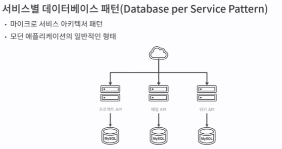

# 분산 시스템에서 데이터를 전달하는 효율적인 방법

### 데이터 전달

**Remote API**

- 사용자 요청에 즉각적인 응답 API 요구될때 간단함

**MessageQueue**

- 비동기 작업에서 주로 사용

**분산 시스템에서 컴포넌트들은 네트워크로 연결**

네트워크는 시스템을 연결하는 유일한 수단이지만 신뢰할 수 없는 매체

- 패킷 손실
- 네트워크 지연(Latency)
- 네트워크 다운

과 같은 항상 데이터 유실에 대비해야한다.

**데이터 보장 방법론**

- At Most Once(최대 한번)
- At Least Once(최소 한번)
- Exactly Once(정확히 딱 한번)

**At Most Once(최대 한번)**

프로듀서가 메세지를 최대 한번만 전송 Fire and forget
컨슈머는 메세지를 최대 한번만 수신 받지만 여기서 문제가

1. 네트워크 유실
2. 프로듀서에서 예외나면
3. 컨슈머에서 예외나면

간단한 구조와 개발이지만 단점으로는 메세지 유실이 있음

**At Least Once(최소 한번)**

최대 한번보장을 업그레이드한 최소 한번 버전이 나왔다.
프로듀서는 최소 한번 이상 발송

- 발송 메세지 상태 관리

컨슈머는 메세지를 최소 한번 이상 수신

- ACK 유실로 인한 재발송

프로듀서 메세지 발송 보장 장점이 있지만 **컨슈머가 멱등성을 보장**해야해야하고 **순서대로 받는다는 보장도 없다**.

**Exactly Once(정확히 딱 한번)**

메세지 정확한게 한번만 발송한다. 누락과 중복이 없기때문에 프로듀서, 컨슈머 모두 상태 관리 해야되고 메세지큐 기능에 의존한 개발이라 시스템 복잡도 증가와 개발 난이도가 급증가한다.

**신뢰성을 위해 최소 한번은 어떻게 만드는데**

- RDB
- RABBIT
- KAFKA

**RDB를 사용하는 애플리케잇녀에서 전달 방법**

만약에 데이터 어떤 서비스에서 다른 서비스로 데이터 전파시 맨처음 DB 트랜잭션으로 데이터 저장후 REST API로 전파한다고 해보자.

이런 상황이고 코드 예시는 아래와 같다.

여기서 @Transactional을 살펴보자 AOP를 사용해서 프록시 객체를 생성해서 코드를 프록시 객체가 한번 감싼다.

프록시가 다른 서비스를 호출하며 내 서비스는 DB에 저장을 할때 DB 트랜잭션에서 예외가 발생하거나 데드락이 발생한다면 롤백이 생기게된다. 이러면 REST API만 호출되는 상황이다.

이런 경우는 **트랜잭션 커밋 이벤트**를 사용해야한다.

스프링부트에서는 두가지 방법이 존재하는데 한가지는

1. @TransactionalEventListner
2. TransactionSyncManager, TransactionSync(두번째는 콜백을 이용하는것이다.)

첫번째는 스프링부트에서 제공하는 어노테이션을 이용하는것이고

다 해결되느냐? 순서는 DB 트랜잭션 먼저 일어나고 REST API가 실패할수있다. 왜냐하면 네트워크는 믿을 수 없기 때문이다.

이러면 저장해야하는 주요 데이터는 DB에 들어가있고 REST API 전파는 못하는 상황이 발생한다 이건 어떻게 하는가?

**@TransactionalEventListner + @Retryable**

이 Retryable이라는 메서드에다 정의를 해주면 실패했을때 재시도를할거다. 근데 이 재시도도 실패하면? 머리가 뜨거워진다.

최대 3번시도를 할거고 리트라이 간격은 백오프를 100ms를 주겠다. 그래도 계속 실패할 수가있다. 네트워크는 믿을 수 없기 때문이다.

만약 처리해야할 데이터와 이벤트가 굉장히 중요하다 한다면

다음과 같은 패턴이 필수적이다.

- Transactional Outbox Pattern
    - RDB를 메세지큐로 사용
    - OLTP에 이벤트 메세지를 포함하는 패턴
- Polling Publisher Pattern
    - RDB 메세지 큐 Poling & Publishing

아웃박스 패턴으로 메세지 상태를 RDB에 박아넣고 배치같은걸로 주기적으로 이벤트를 폴링해서 API를 호출한다. 해당 패턴 사용시 메세지 저장때 필요한 테이블이 필요한데 중요한 4가지를 설명하겠다.

event id는 이벤트 순서를 보장할 수 있는 값을 넣어줘야한다. 왜냐하면 이벤트가 발생하면 순서에 따라 처리해야하는 경우가 있는데 pk인 아이디에 기대면 성능이 좋아지고 편하다.

두번째는 발생 시간을 적어줘야 컨슈머가 이벤트를 받을때 오래된 이벤트는 버릴 수 있다. 밀리세컨드나 나노세컨드까지 적어주면 정확도가 올라간다.

해당 이벤트의 상태를 READY와 DONE 같은 상태 필드를 하나주고 메세지를 저장해야하는 페이로드가 필요하다.

이후에 배치에서 publish 해주는곳도 보면 트랜잭션 어노테이션이 붙어있다. 이렇게 하면 REST API 환경에서 최소 한번을 구현할 수 있다. DB에서 꺼내고 API 호출 실패시 롤백시킨다.

단점으로는 데이터베이스 비례한 처리속도와 데이터베이스 부하를 피할 수가없고 폴링과 퍼블리시 과정으로 인한 지연또한 추가 비용을 감수해야한다.

따라서 대규모 데이터를 전송하는경우 아웃 박스 패턴을 고려를 보류해야한다.

**데드레터**

MQ 기준으로 큐에 가득 쌓여서 정상적으로 처리하지 못한 메세지를 데드레터로 넘겨 데드레터 큐로 넣어준다.

1. 큐의 메세지가 ttl 넘었다
2. 큐가 가득 차버렸다

이것도 최대 시도회수와 백오프 설정이 가능하다. 몇번 시도하고 안되면 데드레터에 넣는다.

**카프카를 사용**

send 프로듀서 토픽과 함께 이벤트 발행

future callback은 success 와 fail 등록한다. 잘 등록된 메타정보를 기록.

onMessage라는 ACK메세지 리스너를 내려받는다.

ack를 받는다.

ack도 받겠다 auto commit config를 4번째 설정을 해줘야한다.