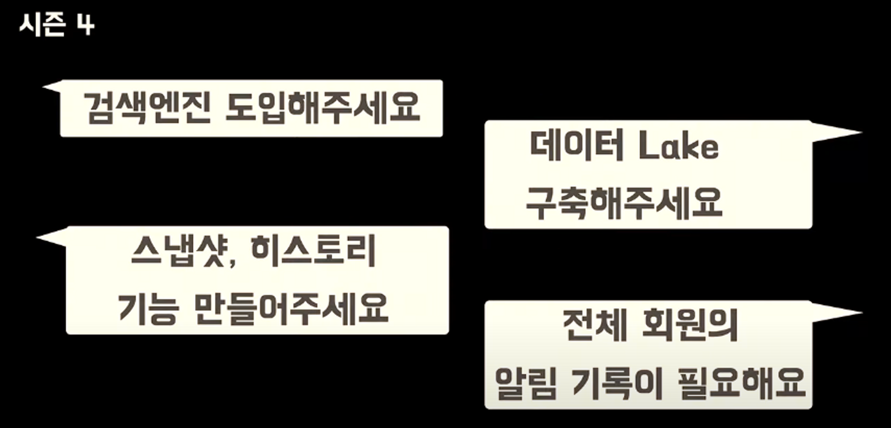
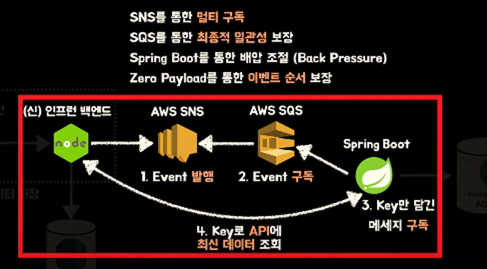

# 인프런 아키텍처의 과거, 현재 그리고 미래

단일 장애가 전체로 번지고있었지만 위와 같은 요구 사항들또한 동시에 진행하는 상황이였음 레디스와 RDB는 유지한채로 검색과 히스토리나 알림성같이 대량의 데이터 처리는 NoSQL인 다이나모DB를 도입해야하는 상황이였다.

100만 레거시 서비스를 저렇게 다 모범 사안으로 쪼개서 수준높게 관리한다는게 현재 수준으로는 불가능하다 판단 기술 가지수를 최소화시키고 좋은 아키텍처 보다는 2년 3년을 버틸 수 있는 적정 기술을 선택한다.

ES와 DDB대신 몽고의 아틀라스를 선택했다. 검색 엔진 기능이 지원이 된다 ES와 같은 내부엔진, Nori 형태소 분석기. 실시간 데이터, Data Lake같은 대량의 처리를 하나로 해결하자.

배민과 같이 AWS의 SNS SQS를 되게 좋아하시는거 같았다 가장 많이 썼기에 익숙한기술이라 빠른 도입이 될거같다. 이벤트 하나만 쏴도 멀티 구독이 되기때문에 글이 하나 변경되면 조회수, 검색 다 적용시킨다.

스프링 배압 조절(Back Pressure)가 신기했는데 이벤트 리스너를 구독해서 스프링에서 처리할 수 있는 양만큼만 이벤트를 빨아들이고 처리가 다되면 다시 반복하는 그런 기능이다.

제로 페이로드는 EDD에서 자주 쓰이는데 메세지에 다른거 없이 키값하나만 넣어서 이벤트가 순서에 관계 없이 항상 일관된 데이터를 받도록 구현되어있다.

**EDD의 질문**

나도 굉장히 궁금했는데 그럼 Node에서 SNS로 이벤트 발행이 실패하면? 재처리 어떻게 할거냐?? 여기 해결책도 명확한데 배민 컨퍼런스에서도 있었는데 이벤트 저장소를 활용하는것이다.

이벤트 저장소를 중간에 두어서 배치를 돌리며 재발행하는 경우로 배민은 이벤트 발행 실패에 대처하고있지만 아키텍처 복잡도가 너무 높아지기 때문에 에러가 발생하면 수동으로 발행한다..