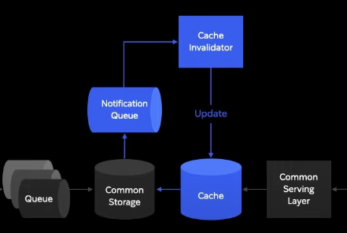

# 쿠팡의 대규모 트래픽을 다루는 백앤드 전략

**캐시 사용 및 데이터 일관성**

  
유니파이드는 데이터 스토리지를 활용하여 다양한 도메인으로의 데이터 전송 IO를 최소화하고 높은 성능을 제공하는데 사용됩니다. 이러한 접근 방식은 컴퓨팅 자원을 효율적으로 사용할 수 있었으며, 고성능을 확보하기 위해 캐시 레이어의 필요성도 나타냈습니다.

캐시 레이어와 커먼 스토리지는 서로 다른 목적과 성격을 갖고 있습니다. 커먼 스토리지는 퍼포먼스 성격이 강하면서도, 캐시 레이어는 높은 레이턴시에 초점을 맞추는 역할을 합니다. 고성능 캐시 레이어를 통해 커먼 스토리지보다 낮은 레이턴시와 높은 처리량을 제공할 수 있게 되었습니다.

이렇게 설정된 환경에서도 주의할 사항이 몇 가지 있습니다. 데이터 스토리지에 반영된 정보가 캐시에 즉시 반영되지 않을 경우, 과거 데이터로 서빙되는 현상이 발생할 수 있습니다. 예를 들어 다른 도메인에서 가격을 변경해도, 캐시에는 이 반영이 되지 않는 것입니다.

이러한 문제를 해결하기 위해 데이터 변경 시 해당 정보는 노티피케이션 큐로 전송되어야 합니다. 그리고 이 시그널들을 활용하여 캐시에 있는 데이터를 최신 데이터로 교체합니다. 이런 메커니즘을 통해 99.99%의 데이터 일치성을 유지하는 것이 가능합니다.

**초단위로 바뀌는 데이터는 리얼타임 스트리밍 도입**

위에 보이는 Cache invalidator를 통해 분단위로 데이터 변경시 일관성을 맞춰주는데 가격, 배송장소, 재고와 같이 초단위로 바뀐다. 이커머스에서는 가격, 할인 정보들이 실시간으로 변하게된다.

이런 정보가 변경된 후에도 이전 정보를 고객에게 보여주거나 판매되는 것은 고객 경험을 나빠지게 할 수 있으며, 회사에 손해를 줄 수 있습니다. 특히 로켓 배송 상품과 같이 지역별 제고와 배송 처리 능력에 따라 상품의 배송 시간을 조정해야 할 경우가 있습니다.

리얼타임 데이터 스트리밍은 다른 마이크로 서비스에서 변경된 데이터를 큐에서 읽어들여 별도의 캐시에 바로 반영하는 방식을 채택합니다. 이로써 Common Serving Layer는 캐시와 리얼타임 캐시를 동시에 확인하여 최신 데이터를 서빙할 수 있도록 설계되었습니다. 이렇게 함으로써 최신의 데이터를 서빙하는 전략을 채택합니다.

**최신 데이터 일관성은 맞췄는데 가용성은?**

가용성은 어떤 상황에도 고객 경험에 영향을 최소화하는 것을 의미합니다. 리얼 타임 캐시에 장애가 나면 고객 페이지가 다운되는것보다 실시간 데이터가 반영되지 않는 페이지를 보여주는 것이 더 좋은 선택

**서킷 브레이커 사용**

코어 서빙 레이어는 모든 IO 장애 발생 시 해당 장애를 아이솔레이션하여 캐스케이딩되지 않도록 해야 합니다. 코어 서빈 레이어는 서킷 브레이커라는 기술을 통해 해당 컴퍼넌트의 장애를 고립시키고 필요 시 수동으로 해당 컴포넌트로 가는 IO를 끌 수 있게 설계

**Critical Serving Path(CSP)**  
  
많은 페이지 중에서 고객 경험에 중대한 영향을 미치는 페이지가 존재, 이러한 페이지 중 하나라도 다운되면 고객 경험이 크게 영향받을 수 있기 때문에 이러한 페이지에 대한 고려가 필요(홈, 주문, 검색)과 같이 비지니스에 직접적인 영향을 미치는 페이지들

CSP(Cluster for Critical Serving Path)와 NCSP(Cluster for Non-Critical Serving Path)는 쿠팡의 서비스 아키텍처에서 사용되는 두 가지 클러스터로, 각각 독립적인 역할을 수행하는 이유가 존재함

**가용성과 안정성 증가**

CSP 클러스터와 NCSP 클러스터를 분리하는 이유는 두 클러스터 간에 독립성을 유지하기 위함입니다. NCSP 클러스터의 문제가 발생해도 이는 CSP에 영향을 미치지 않습니다. 반대로 CSP 클러스터의 문제가 생겨도 배포 없이 동적으로 해당하는 모든 페이지가 NCSP 클러스터를 대체

**중복 코드 관리를 위한 템플릿**

만약 각각의 도메인이 구조는 같지만 다른 코드 베이스로 동작한다면 중복 코드가 증가하고 관리가 어려워집니다. 이런 문제를 해결하기 위해 코어 서빙 템플릿을 만들었습니다. 코어 서빙 템플릿은 핵심 로직을 공유하고, 컴파일레이션을 통해 동작이 변경되는 컴파일레이션 헤드 코드를 지향합니다. 이렇게 함으로써 커먼 스토리지의 주소, 캐시의 주소, 리얼타임 캐시의 주소만 변경하면 새로운 도메인의 코어 서빙 레이어가 생성됩니다. 이것이 코어 서빙 템플릿의 역할

이제는 이 플랫폼을 기반으로 운영하면서 우리 팀이 경험한 기술적 어려움과 이를 극복하기 위한 노력을 공유하고자 합니다. 이 동안 겪은 기술적 어려움은 주로 어빌리티와 스루프 측면에서 발생했습니다. 어밸리빌리티 측면에서는 **하드웨어와 소프트웨어 결함**으로 인한 문제가 있었으며,

스루프 측면에서는 **서버 처리량 초과로 급격한 사용자 유입**으로 인한 문제가 발생했습니다. 특히 캐시 레이어가 큰 영향을 미쳤는데, 이를 위해 높은 스루프 처리와 실시간 데이터 반영을 위해 2개의 대규모 캐시 클러스터를 사용하고 있습니다.

**캐시 레이어 도전과제**

트래픽이 많기 때문에 이 캐시 클러스터의 크기는 60대에서 100대의 노드로 구성되어 있고, 전체 트래픽 중 약 95% 이상을 캐시에서 처리하고 있습니다. 이로써 캐시 클러스터에서 발생하는 높은 의존도가 총 플랫폼의 전체에 미치는 영향을 미친다.

개별 로드의 다운은 일반적인 현상이며, 이러한 문제를 위해 우리는 클라우드 환경에서 운영 중입니다. 다만 캐시 클러스터의 크기가 크다보니 개별 로드가 다운되는 현상을 자주 경험합니다.

때로는 언더라인 포스트의 문제로 인해 여러 개의 노드가 동시에 다운되기도 하며, 이로 인해 1분에서 10분 동안 시스템이 불안정해지는 현상을 자주 겪었습니다. 이런 상황에서도 최소한의 영향을 보장하기 위해 더 나은 해결책을 찾고 노력하게 되었습니다.

**서킷 브레이커의 한계**

일부 노드 다운으로 인한 문제는 전체 트래픽 중 일부만의 문제로 서킷 브레이커로는 해결되지 않습니다. 캐시 클러스터는 실패한 노드를 빠르게 탐지하여 클러스터 토폴로지를 조정하지만 이러한 복구 작업에는 시간이 필요하며, 이 동안 처리되지 못한 요청들은 타임아웃이 발생하거나 내부 큐에 쌓이게 되어 애플리케이션이 느려집니다. 또한 클러스터 토폴로지 변경 시에는 실제로 사용되는 TCP 커넥션과 일치하지 않아 다운된 노드로 트래픽이 지속적으로 유입되는 현상도 발생할 수 있습니다.

**안정성 강화: 노드 다운 대응의 레일가드**

시스템의 안정성을 높이기 위해 다운된 노드로 가는 트래픽을 빠르게 배제할 수 있는 해결책이 필요했습니다. 이를 위해 캐시 클러스터가 제공하는 토폴로지 리프레시 기능을 활용하면서, 우리가 사용하는 TCP 커넥션들이 빠른 응답을 받는지 감시하도록 조치했습니다. 일반적으로 캐시 레이어의 응답 속도는 몇 밀리초 정도이므로, 1초 동안 응답이 없는 커넥션은 문제가 있는 것으로 간주하고 자동으로 클로즈하도록 설계했습니다. 이를 통해 노드 장애를 더 빨리 감지할 수 있었고, 시스템의 안정성을 향상시킬 수 있었습니다.

다운된 노드로 인한 높은 트래픽은 클러스터 리커버리 과정에서도 문제를 일으키는데, 리커버리 후에 노드가 다시 활성화되면 풀 싱크 과정을 거쳐 클러스터에 다시 참여합니다. 이때 마스터 노드는 이 과정 중에 들어오는 라이트 커맨드들을 저장합니다. 하지만 높은 트래픽으로 인해 이러한 풀 싱크 및 리커버리 과정이 지속적으로 실패할 수 있었습니다. 단기적인 해결책으로는 캐시 인밸리데이션을 중지하는 기능을 도입하여, 리커버리 과정 중에 5분에서 10분 동안 캐시 인 벨리데이션을 일시적으로 비활성화하거나, 또는 어쩔 수 없이 클러스터 전체를 재생성하여 교체하는 방법을 사용해야 했습니다.

**악명 높았던 신규 스마트폰 이벤트와 코로나**

오토 스케일링이 트래픽 증가 수치를 못따라가는 현상이 자주 목격. 예약 이벤트라 미리 서버 대수를 늘렸지만 예상하지 못한 트래픽이 올때도 존재했다.

코로나 여파로 마스크 재고가 들어올때마다 트래픽이 발생함. 어쩔 수 없이 트래픽 대비 서버 용량의 3배를 항상 띄워놓을수밖에 없었다.

**성능 끌어올리기 GC를 줄이기위해 바이트 어레이?**

메세지 큐에 있는것들로 뭐가 문제인지 분석. 특정 사용자와 특정 상품이 상당 부분을 차지했는데 로컬 캐시 레이러를 추가해서 성능면에서 이점이 있지만 인벨리데이션과 GC문제가 단점으로 꼽힌다.

로컬 캐시에 대한 인벨리이션을 따로 처리해주지 않았기때문에 캐시 유지 기간을 1분내로 제한하였고 실시간 데이터가 아닌 최종적 일관성을 보장할 수 있는 데이터에만 적용했다.

GC 회수와 소요시간도 늘었는데 줄이기 위해서 DTO 형태가 아닌 바이트 어레이 형태로 저장하고 직렬화 비용을 더 들더라도 GC 비용을 줄일 수 있었음

바이트 어레이 형태로 데이터를 저장하면 더 많은 메모리를 사용할 수 있지만, 이로 인해 GC의 비용을 줄일 수 있습니다. DTO는 더 많은 메모리를 사용하지만 GC 비용이 상대적으로 적지만, 바이트 어레이 형태로 저장하면 직렬화 및 데이터 전송에 비용이 더 들 수 있습니다. 이런 경우, 성능 향상을 위해 GC 비용을 줄이는 것이 더 우선시되었기 때문에 바이트 어레이 형태를 선택한 것으로 이해할 수 있다.

기존은 콜마다 스레드 사용하는 블록킹 기반 애플리케이션을 논블럭킹 IO기반 NIO 구조로 개선했음 2배이상 CPU 사용률 감소